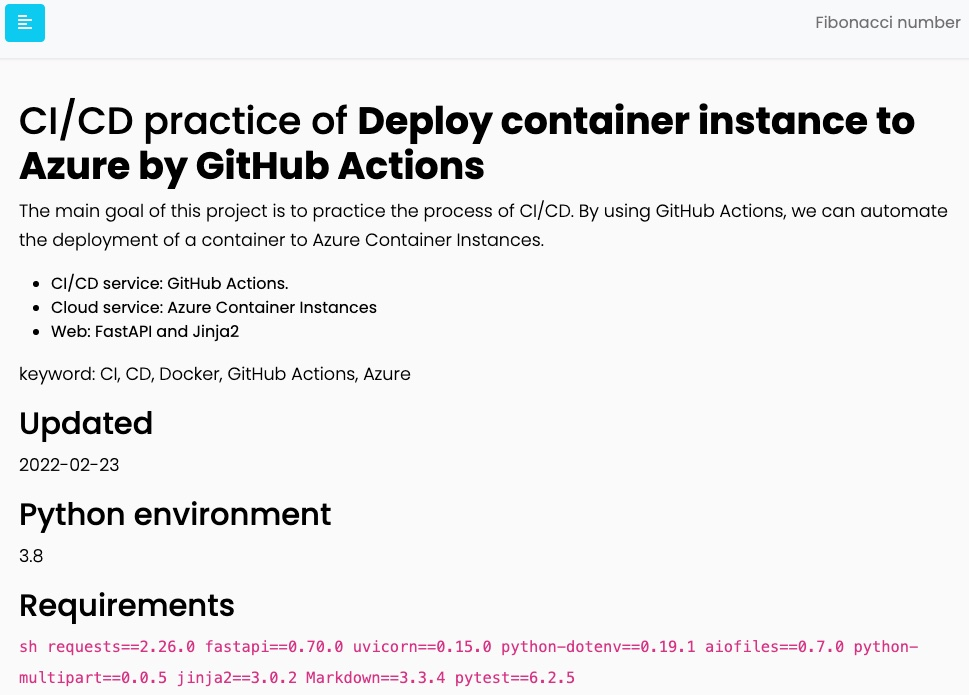
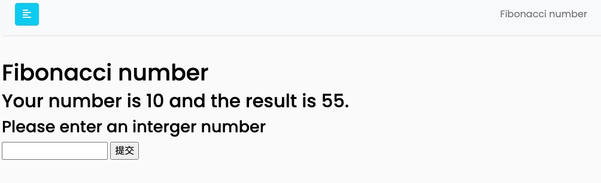

# CI/CD practice of **Deploy container instance to Azure by GitHub Actions**

Updated: 2022-02-23

## Overview

The main goal of this project is to practice the process of CI/CD. By using GitHub Actions, we can automate the deployment of a container to Azure Container Instances.

This repo includes all the files, and the simple website is ready to deploy to Azure.

On this website, people can play Fibonacci number.

## Tools

- CI/CD service: [GitHub Actions](https://github.com/features/actions).
- Cloud service: [Azure Container Instances](https://azure.microsoft.com/en-us/services/container-instances/)
- Web: [FastAPI](https://fastapi.tiangolo.com/) and [Jinja2](https://jinja.palletsprojects.com/en/3.0.x/)

## CI/CD Workflow

1. The auto testing will be triggered by the workflows of GitHub Actions if there are any code changes. The testing includes simple website testing and the Fibonacci number test.
2. After the auto testing finishes, GitHub Actions deploys a container to Azure Container Instances.

## Requirement

See requirements.txt for updates.

```sh
requests==2.27.1
fastapi==0.72.0
uvicorn==0.17.0
python-dotenv==0.19.2
aiofiles==0.8.0
python-multipart==0.0.5
jinja2==3.0.3
Markdown==3.3.6
pytest==6.2.5
```

## Local Installation & Usage

```bash
$ git clone git@github.com:KimiHsieh/fibonacci_app.git
$ cd fibonacci_app
# install packages
$ pip install -r requirements.txt
# start the server
$ uvicorn app.main:app --host=0.0.0.0 --port=80
```

After the local server is started, visit [http://127.0.0.1:80](http://127.0.0.1:80).

<p align = "center">


</p>
<!--  -->

## Test

All tests are under `tests` directory.

```bash
# Change the directory
$ cd fibonacci_app
# Run tests
$ pytest -v
```
